# 上海电信 IPTV 教程

<!-- TOC -->
* [上海电信 IPTV 教程](#上海电信-iptv-教程)
  * [1. 前言](#1-前言)
  * [2. 光猫设置](#2-光猫设置)
    * [2.1 VLAN 85 桥接](#21-vlan-85-桥接)
      * [2.1.1 电信公版界面](#211-电信公版界面)
      * [2.1.2 华为界面](#212-华为界面)
    * [2.2 IGMP 设置](#22-igmp-设置)
      * [2.2.1 电信公版界面](#221-电信公版界面)
      * [2.2.2 华为界面](#222-华为界面)
  * [3. 转发网关设置](#3-转发网关设置)
    * [3.1 VLAN85 DHCP 获得 IP](#31-vlan85-dhcp-获得-ip)
    * [3.2 防火墙设置](#32-防火墙设置)
    * [3.3 软件组播转单播转发设置](#33-软件组播转单播转发设置)
  * [4. 组播 IP 源获取](#4-组播-ip-源获取)
  * [5. 结语](#5-结语)
<!-- TOC -->

## 1. 前言
本文旨在以较为小白的语言记录上海 IPTV 组播转单播转发的配置方法。

首先我们先用恩山大佬 [@tony197511](https://www.right.com.cn/forum/space-uid-404755.html) 制作的上海 IPTV 业务架构图作为开始：
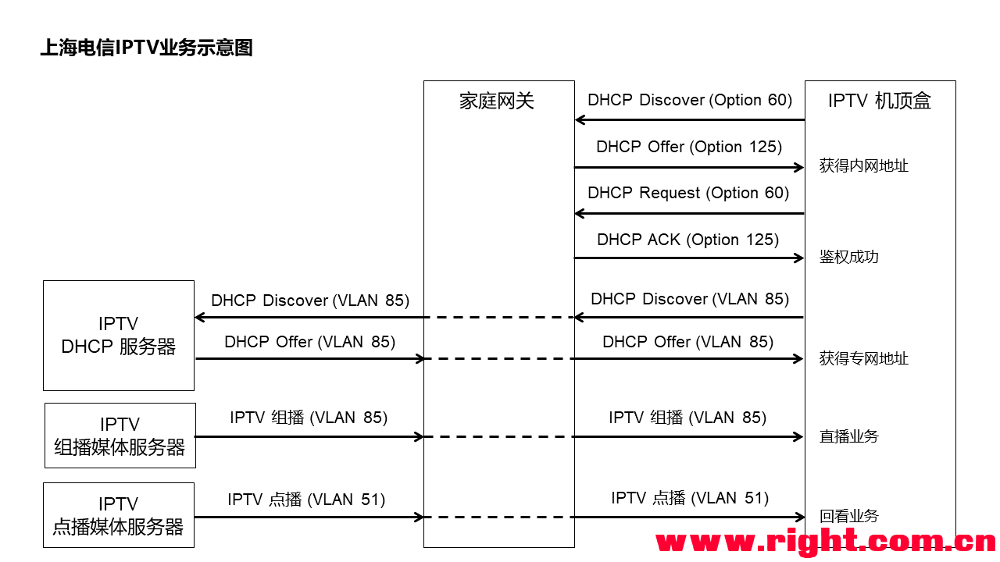

基于此业务架构图可知，对于 IPTV 来说核心有两点 
1. 通过 VLAN 85 获得 IP
2. VLAN 85 与 VLAN 51 共同获得数据。

基于上述原则实际可以有多个方案获得 IPTV 数据，例如直接在路由器上通过 vlan 虚拟数据交换来进行数据耦合等。

本文基于简单直接的原则，选择在光猫独立端口上实现 VLAN及组播设置，而在路由上只需要进行拨号及转发即可。

本教程为傻瓜教程，旨在帮助 0 经验读者,有经验的读者可直接基于上图及 [4. 组播 IP 源获取](#4-组播-ip-源获取) 开始的内容获得 组播IP 即可，相信网络老手一定能设计出更符合自己网络环境的方案。

## 2. 光猫设置

我们首先要在光猫上实现 VLAN 85 及 VLAN 51 的组播设置。

在开始正式介绍前需要先针对 ITV 口进行一定说明，ITV 口实际就是在这个口上完整配置了 IPTV 业务所需要的功能。

因此对于没有光猫超密但是已下发 ITV 口配置的用户，可直接跳过这一章，直接使用 ITV口 进入 [3. 转发网关设置](#3-转发网关设置) 部分。

由于日常用户主要集中在中兴光猫和华为光猫 (~~其实是作者只有华为和中兴的猫~~)。因此，本文将只针对 
1. 电信公版界面（中兴光猫及电信固件的华为猫）
2. 华为界面（华为公版固件的猫）

其他光猫及猫棒用户请参阅本章后设置光猫上的类似选项。

### 2.1 VLAN 85 桥接

#### 2.1.1 电信公版界面
电信公版界面的拨号和组播绑定是分开的，我们首先进行拨号设置。直接 VLAN 85 桥接即可：
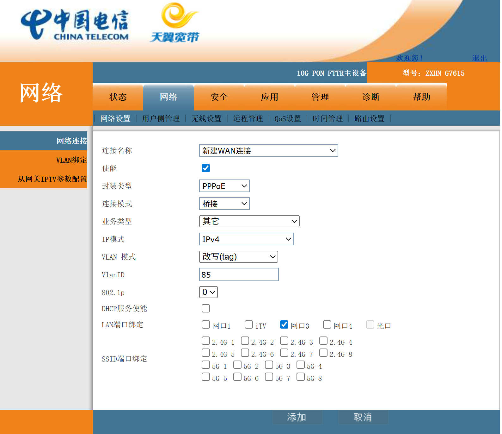

设置成功后会有 [x]_Other_B_VID_85 的网络, 对此网络进行端口绑定，此操作在 网络-网络设置-VLAN绑定中进行：
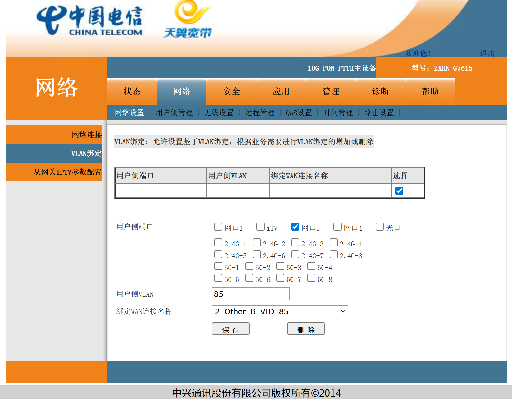

绑定完后此界面会显示绑定信息：
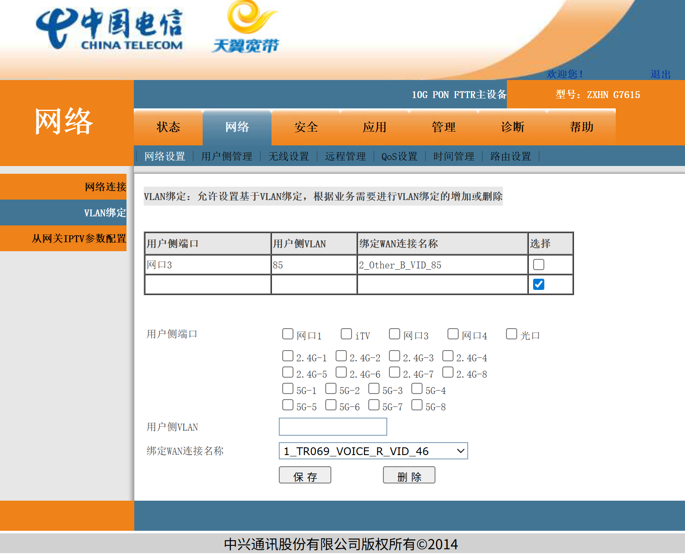

#### 2.1.2 华为界面
华为界面的拨号和组播绑定是一起的，我们在拨号设置中把 VLAN 85 和 VLAN 51 一并设置了：
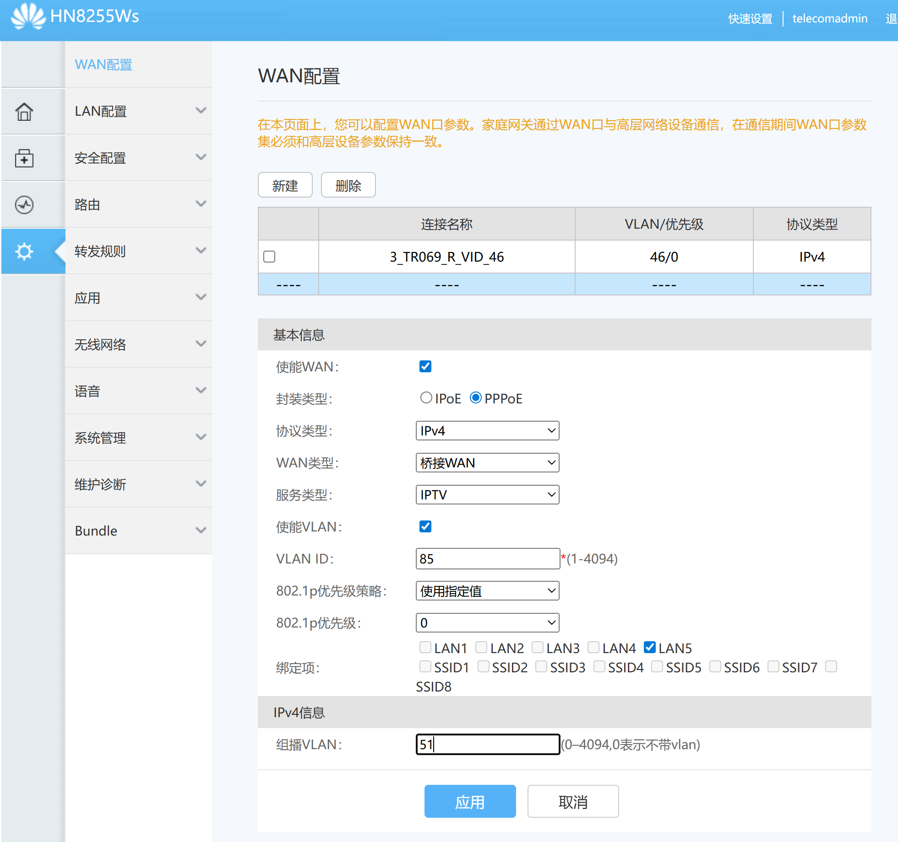
成功后如下：


### 2.2 IGMP 设置
IGMP是用于多IPv4组播成员管理的协议,在 IPTV 中其主要实现多播鉴权和 VLAN 转发。

本文只指针 IPTV 直播业务，基于 IPTV 业务架构, 我们只需要启用 IGMPSnooping 功能，以实现 VLAN 51 鉴权即可。
如果有 IPTV 点播及回放需求的请进一步开启 IGMPProxy。

#### 2.2.1 电信公版界面
电信界面的 IGMP 绑定位置 在 应用-IGMP设置-组播设置中，示意图如下：
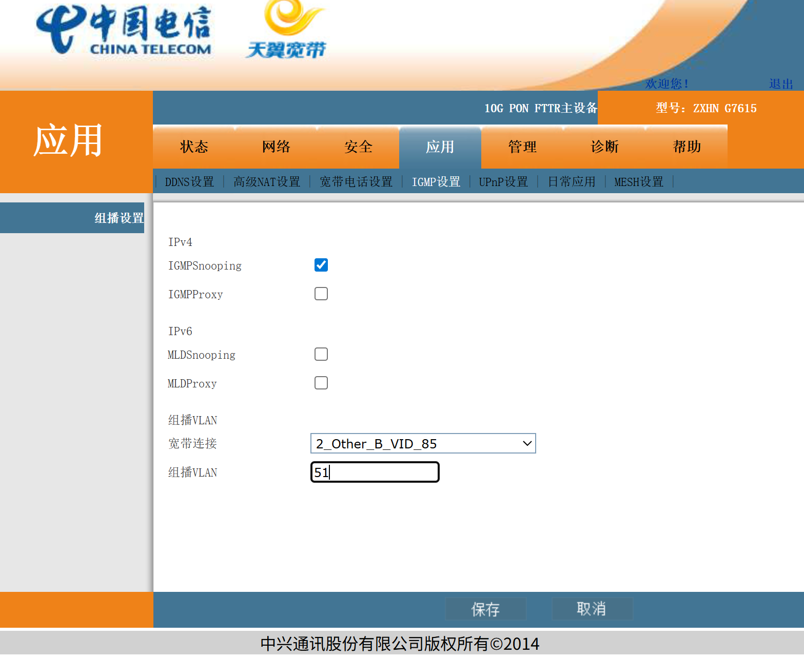
本文只设置 IGMPSnooping 功能, 有点播和回放转发需求的记得也打开 IGMPProxy 功能。

#### 2.2.2 华为界面
华为界面在[2.1.2 华为界面](#212-华为界面)中已经设置了组播 VLAN，此处只需打开 IGMP 即可, 设置位置在 设置-应用-组播配置：

同样本文只设置 IGMPSnooping 功能, 有点播和回放转发需求的记得也打开 IGMPProxy 功能。

## 3. 转发网关设置

在基于上一步的光猫设置后，我们已经完成了 VLAN 和组播设置，本节将实现 IPTV 拨号和转发。
本教程所使用的转发网关为 树莓派4b, 使用 LEDE R24.10.24 系统，组播转单播转发软件使用 UDPXY
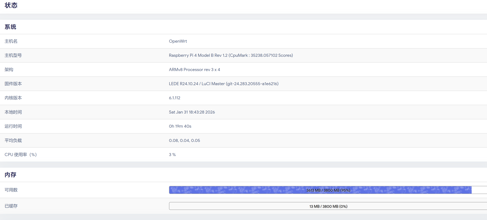

由于 UDPXY 软件较老，部分软路由固件可能不支持。

对于这些软路由固件及裸机linux，推荐使用 msd_lite (实际大部分情况都推荐优先选择 mds_lite, 软件新，架构更好，性能更好)

对于裸机linux, 可直接通过github仓库 [rozhuk-im/msd_lite](https://github.com/rozhuk-im/msd_lite) 自己编译（轻量化，编译很快很简单），自己配置配置文件即可使用。

对于 UDPXY 和 msd_lite 除了 下文 [3.3 软件组播转单播转发设置](#33-软件组播转单播转发设置) 节中的转发软件设置不同外其余部分完全相同，对于这一不同部分可参考此知乎文章中 msd_lite 进行设置：
[体验msd_lite替换udpxy](https://zhuanlan.zhihu.com/p/1906718559213688181)

### 3.1 VLAN85 DHCP 获得 IP
转发网关首先需要在 VLAN85 上获得 IP, 在 [2.1 VLAN 85 桥接](#21-vlan-85-桥接) 的光猫设置中，我们已经设置了 VLAN85 的桥接，我们直接 DHCP 即可获得 IP
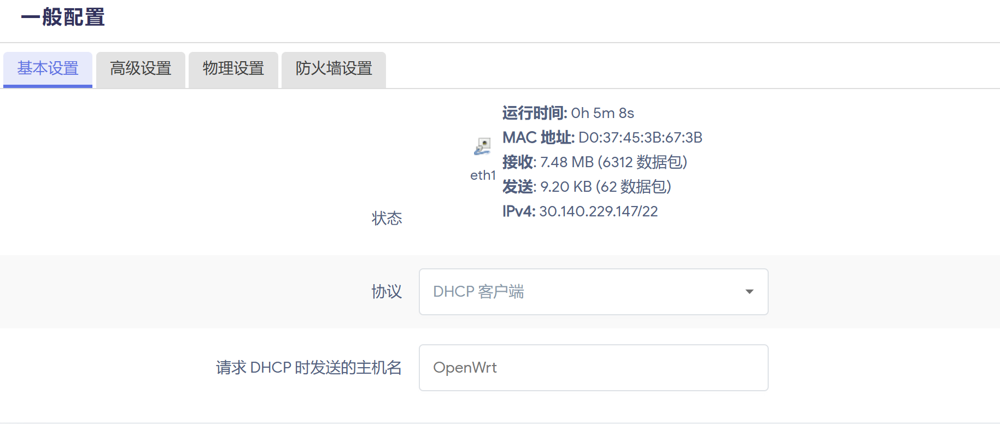

获得 30.140 即成功接入 IPTV 网关 
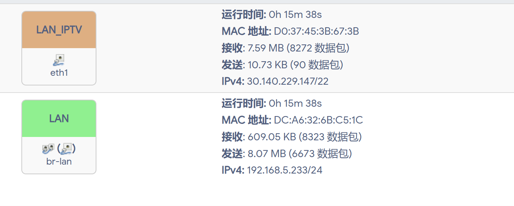


### 3.2 防火墙设置

在上一步我们成功连入了 IPTV 内网，下一步我们要修改防火墙，使得 IPTV 和 lan/wan之间可转发。
如下图所示创建一个新的防火墙区域，允许lan/wan与其的转发。（本示意中是与lan转发，如需转发到公网，请对应修改到wan）

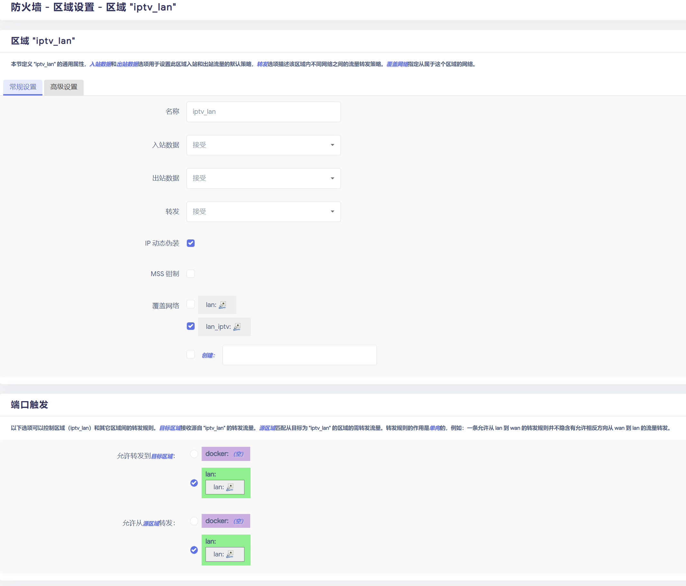

### 3.3 软件组播转单播转发设置

本步开始对 IPTV 数据进行转发，本教程以 udpxy 为例，如使用 msd_lite 请参考: [体验msd_lite替换udpxy](https://zhuanlan.zhihu.com/p/1906718559213688181)

首先安装 udpxy 及 luci 


接下来对udpxy 进行设置，示意图如下：
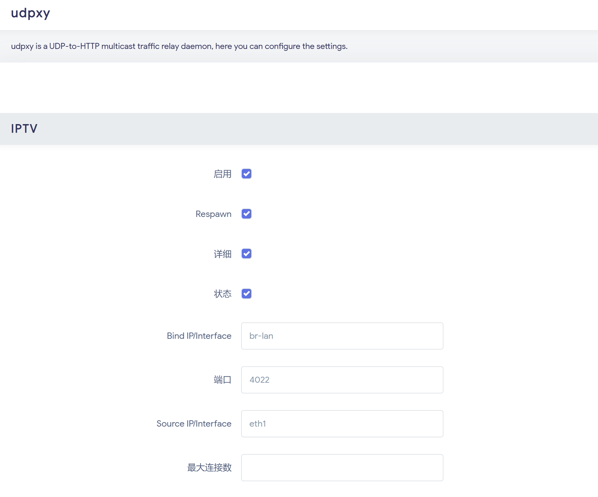
其中 Bind IP/Interface 是你要转发到的 lan/wan 接口。本示意图中为转发到 lan,如需转发到公网请修改为对应 wan

Source IP/Interface 为需要转发的 IPTV 接口，请设置为 [3.1 VLAN85 DHCP 获得 IP](#31-vlan85-dhcp-获得-ip) 中 dhcp 接口

端口为你想在在 lan/wan 上转发的接口，此处使用默认端口。

保存运行后便可开始工作，此时基于设置的端口在 lanip:port/status 可以查看 udpxy 运行状态，例如本文通过 http://192.168.5.233:4022/status 可以查询到 udpxy 工作状态如下：


能够正确获得到Server Process ID 和 IPTV IP 即为正常工作。


## 4. 组播 IP 源获取

在上述步骤后，我们已经将 IPTV 信号转发到了公网或是内网中，但是我们还需要知道 IPTV 中具体的组播 IP 源才能抓到具体视频信号。

在这里感谢恩山 [@deny12138](https://www.right.com.cn/forum/space-uid-544318.html) 大佬提供的上海电信 IPTV M3U 和 EPG 抓取程序。

通过 GitHub 仓库 [denymz/sh-tel-iptv-spider](https://github.com/denymz/sh-tel-iptv-spider) 的代码，你可以直接从上海电信 IPTV 网络中爬取到所有电视节目源和 EPG 信息。

如果你不想自己抓取，你也可以直接使用 deny 大佬每天更新的的自动化抓取源。
* 源：   https://epg.deny.vip/sh/tel-xteve.m3u
* EPG： https://epg.deny.vip/sh/tel-epg.xml

请注意 deny 佬抓取的 M3U 源要经过一定修改才能使用，如：

```aiignore
#EXTINF:-1 tvg-id="101" tvg-name="东方卫视" tvg-logo="https://epg.deny.vip/ws/dongfang.png" group-title="卫视",东方卫视HD
udp://@233.18.204.51:5140
```
要修改为

```aiignore
#EXTINF:-1 tvg-id="101" tvg-name="东方卫视" tvg-logo="https://epg.deny.vip/ws/dongfang.png" group-title="卫视",东方卫视HD
http://192.168.5.233:4022/udp/233.18.204.51:5140
```

其中 192.168.5.233 是[3.3 软件组播转单播转发设置](#33-软件组播转单播转发设置) 中我的Bind IP/Interface接口。
大家也可以直接基于本仓库 [jyjiptv.m3u8](jyjiptv.m3u8) 文件将 192.168.5.233 改为自己的绑定的 IP使用。

在完成 M3U 和 EPG 的抓取后，将其放入 IPTV 软件中即可进行观看了。


## 5. 结语
本文方案仅仅是一个最为简单的小白友好方案，全程不需要进行命令行设置，仅通过 GUI 即可完成所有操作，实际有较多内容都可进行优化。

包括后续也可结合 xteve 等软件进一步实现 M3U 源的分发等，希望大家在参考的同时也可以基于自己的网络环境搭建出属于自己的 IPTV 转发方案。